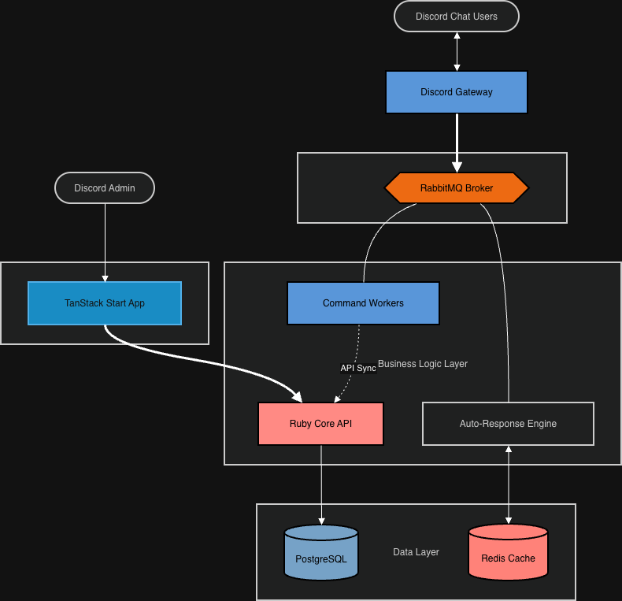

# Robotman

Robotman is a high-performance, distributed Discord bot infrastructure designed for scalability and extreme UI performance. It utilizes a microservice architecture communicating via a RabbitMQ event bus to handle large-scale automation and guild management.

## System Architecture

The system is organized as a monorepo containing specialized services for gateway connectivity, business logic, and administrative control.



### Core Components

#### 1. Gateway (packages/gateway)
A stateless Node.js service that maintains a persistent WebSocket connection to Discord. It receives events, strips unnecessary payload weight, and publishes them to the RabbitMQ exchange.

#### 2. API (packages/api)
The central authority for data state and authentication, built with Ruby on Rails. It manages the PostgreSQL schema, handles OAuth2 flows, and broadcasts state updates to the system via RabbitMQ.

#### 3. Worker (packages/worker)
Execution engine for slash commands and complex integrations. Built with NestJS, it subscribes to interaction events and utilizes shared services for command logic.

#### 4. Auto-Response (packages/auto-response)
A high-throughput text processing engine built with NestJS and Redis. It handles real-time message scanning and response generation using an internal Redis cache for sub-millisecond lookups.

#### 5. Dashboard (packages/dashboard)
The administrative frontend built with TanStack Start, Router, and Query. It provides a type-safe, performant interface for managing guild settings and automation triggers.


## Technology Stack

- Language: TypeScript (Node.js/NestJS), Ruby (Rails)
- Primary Database: PostgreSQL
- Message Broker: RabbitMQ (robotman.events topic exchange)
- State and Cache: Redis
- Frontend: React, TanStack Start, Tailwind CSS
- Observability: Prometheus, Grafana, Sentry

## Infrastructure Overview

Communication between services is strictly asynchronous via RabbitMQ. Every state change in the API broadcasts an invalidation event that workers and the auto-response engine consume to hydrate their local or Redis-based caches.


## Development

### Prerequisites

- Node.js (v20+)
- Ruby (v3.2+)
- Docker and Docker Compose
- RabbitMQ, Redis, and PostgreSQL

### Local Setup

1. Clone the repository.
2. Install dependencies:
   ```bash
   npm install
   bundle install --gemfile packages/api/Gemfile
   ```
3. Start infrastructure:
   ```bash
   docker compose up -d
   ```
4. Run development servers:
   ```bash
   npm run dev
   ```

## Development Protocol

- Contract-First: Always reference shared/events.ts for RabbitMQ logic and schema.sql for database logic.
- Type Safety: Strict typing is enforced across all TypeScript packages.
- Distributed Tracing: Every service propagates traceparent headers via RabbitMQ to maintain visibility across the stack.
- Testing: Every feature must be accompanied by its corresponding test suite (RSpec for API, Jest for NestJS, Vitest for Frontend).
